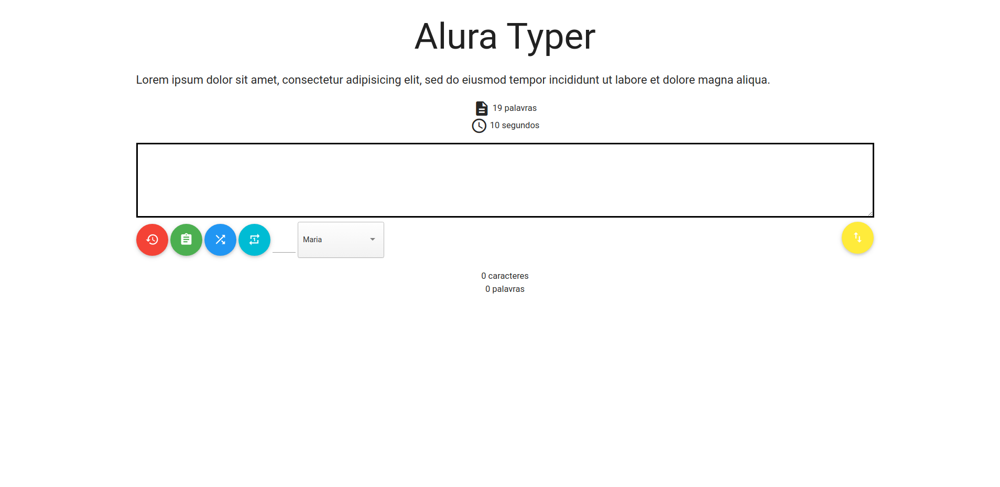

# AluraPlay

É um jogo onde é possível medir a velocidade que o jogador digita uma frase.

## Screenshots

## Objetivo

Treinar o consumo de API e requisições GET e POST com JQuery.

## Funcionalidade

- Adicionar nome do jogador;
- Trocar as frases;
- Escolher uma frase específica;
- Visualizar resultados no placar;
- Salvar os resultados do placar;
- Excluir resultados.

## Tecnologias utilizadas
* Javascript;
* JQuery;
* NPM.